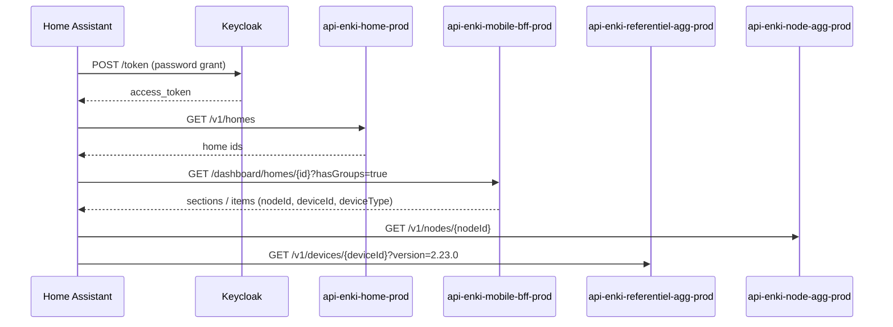

# Enki cloud API — engineering notes

This integration talks to the **unofficial** Enki REST API used by the Leroy Merlin / Adeo mobile app. There is no public developer portal for end users; behaviour was inferred from network traffic and existing community work.

## Authentication

| Item | Value |
|------|-------|
| OIDC token URL | `https://keycloak-prod.iot.leroymerlin.fr/realms/enki/protocol/openid-connect/token` |
| Grant | `password` (resource owner) |
| Client ID | `enki-front` |
| API gateway | `https://enki.api.devportal.adeo.cloud` |

Every microservice call sends:

- `Authorization: Bearer <access_token>`
- `X-Gateway-APIKey: <service-specific key>`
- `homeId: <uuid>` when the node belongs to a home

Gateway keys are bundled in `custom_components/enki/const.py`. They can change when the mobile app updates; capture fresh keys with mitmproxy if requests start failing with `401`/`403`.

## Discovery flow

## Supported device types (this integration)

Detection is **capability-based** (referentiel metadata + BFF dashboard), not limited to a fixed list of model names.

| Referentiel / BFF type | HA platforms | Backend services |
|------------------------|--------------|------------------|
| `ceiling_fans` (+ fan capabilities) | `fan` + `light` | `api-enki-airflow-prod`, `api-enki-lighting-prod`, `api-enki-power-prod` |
| `lights` (+ light capabilities) | `light` | `api-enki-lighting-prod` |
| Switches / outlets (Edisio, …) | `light` (ON/OFF) | `api-enki-power-prod` (`switch-electrical-power`) |
| `inverters` (Envertech-Lexman solar) | `sensor` (power W) | BFF dashboard `description.value` |
| `access_and_motorizations` (Evology, Nodon, …) | `cover` (beta) | `api-enki-access-and-motorizations-prod` |
| `sensors` (motion, contact, temperature, …) | `binary_sensor`, `sensor`, `switch`, `number` | `api-enki-presence-detector-prod`, `api-enki-contact-sensor-prod`, `api-enki-temperature-humidity-sensor-prod`, `api-enki-battery-health-prod`, `api-enki-siren-prod` |

Sensor capability paths follow the same pattern as [StephaneBranly/ha-enki](https://github.com/StephaneBranly/ha-enki): `GET/POST …/v1/sensors/{node_id}/{kebab-case-capability}` (siren uses `/v1/siren/`).

Multi-endpoint lights (several circuits on one node) create one HA light entity per BFF `mainChangeCapability` endpoint.

### Ceiling fan (Inspire Siroco+, ESDK)

State is split across services:

| Field | Endpoint | Notes |
|-------|----------|-------|
| `fan_speed` | `GET …/check-fan-speed` | `0` = off, `1–6` = speed levels |
| `airflow_mode` | `GET …/check-airflow-mode` | `MANUAL`, `BREEZE` |
| `airflow_rotation` | `GET …/check-fan-rotation-direction` | `CLOCKWISE` / `COUNTERCLOCKWISE` when supported |
| Light on/off (`light_power`) | `api-enki-lighting-prod` | `check-light-state` → `lastReportedValue.power` |
| Light `brightness`, `colorTemperature` | `api-enki-lighting-prod` | `change-light-state` (full `lastReportedValue` payload) |

Commands:

- `POST …/change-fan-speed` — body `{"value": <0-6>}`, expect `202`
- `POST …/change-airflow-mode` — body `{"value": "MANUAL"|"BREEZE"}`, expect `202` or `204` (mode brise)
- `POST …/change-fan-rotation-direction` — body `{"value": "CLOCKWISE"|"COUNTERCLOCKWISE"}`, expect `202` or `204` (Inspire; enables `fan.set_direction` in HA)
- `POST …/change-light-state` — full `lastReportedValue` object, expect `202`
- `POST …/change-light-state` — body is the full lighting state object; `power` ON/OFF for the fan light kit
- `POST …/switch-electrical-power?endpoints=1|2` — fan motor only in practice; light kit uses lighting `power`

Fan motor and light kit are **independent** (turning the fan on does not switch the light on).

### Roller shutters (Evology SIN2RS1, …) — beta

**Base URL:** `https://enki.api.devportal.adeo.cloud/api-enki-access-and-motorizations-prod/v1/`

| Field | Endpoint | Notes |
|-------|----------|-------|
| `shutter_position` | `GET …/check-shutter-position` | `0–100` (% open) |
| `shutter_opening` | `GET …/check-shutter-opening` | `OPEN` / `CLOSED` |

Commands:

- `POST …/change-shutter-position` — body `{"value": <0-100>}`, expect `202` or `204`

Gateway key: `ENKI_ACCESS_MOTORIZATION_API_KEY` in `const.py`. Capture procedure: [BETA_VOLETS_KEY.md](BETA_VOLETS_KEY.md). End-user testing (no proxy): [SUPPORTED_DEVICES.md](SUPPORTED_DEVICES.md#pour-les-testeurs).

### Standard lights (Eglo V-Link, Lexman, etc.)

| Capability | Parameter | Wire format |
|------------|-----------|-------------|
| On/off | `power` | `"ON"` / `"OFF"` |
| Brightness | `brightness` | float, device-specific max (often `100`) |
| Colour temperature | `colorTemperature` | `"T3500K"` style strings |

## Future device families (not implemented yet)

The Enki app also controls heating, alarms, and Enki scenarios via other microservices (`api-enki-heating-prod`, BFF scenario player, etc.). Use `scripts/discover_devices.py` to dump unknown `deviceType` values from your account before adding new platforms.

## References

- Fork base: [CyrilP/hass-enki-component](https://github.com/CyrilP/hass-enki-component) (lights)
- Fan / airflow research: community reverse engineering of ESDK ceiling fans
- Product docs: [Enki support — Inspire](https://support.enki-home.com/)
