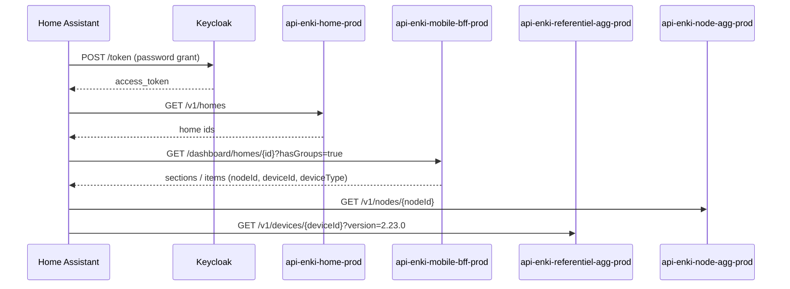

# Enki cloud API — engineering notes

This integration talks to the **unofficial** Enki REST API used by the Leroy Merlin / Adeo mobile app. There is no public developer portal for end users; behaviour was inferred from network traffic and existing community work.

## Authentication

| Item | Value |
|------|-------|
| OIDC token URL | `https://keycloak-prod.iot.leroymerlin.fr/realms/enki/protocol/openid-connect/token` |
| Grant | `password` (resource owner) |
| Client ID | `enki-front` |
| API gateway | `https://enki.api.devportal.adeo.cloud` |

Every microservice call sends:

- `Authorization: Bearer <access_token>`
- `X-Gateway-APIKey: <service-specific key>`
- `homeId: <uuid>` when the node belongs to a home

Gateway keys are bundled in `custom_components/enki/const.py`. They are **embedded in the Enki mobile APK** (one key per micro-service), not fetched from a central API. Refresh them after an app update with `scripts/extract_gateway_keys.py` (see [DEVELOPMENT.md](DEVELOPMENT.md)). Requests failing with `401`/`403` usually mean outdated credentials or gateway keys — Home Assistant shows a **persistent notification** with guidance.

## Discovery flow

## Supported device types (this integration)

Detection is **capability-based** (referentiel metadata + BFF dashboard), not limited to a fixed list of model names.

| Referentiel / BFF type | HA platforms | Backend services |
|------------------------|--------------|------------------|
| `ceiling_fans` (+ fan capabilities) | `fan` + `light` | `api-enki-airflow-prod`, `api-enki-lighting-prod`, `api-enki-power-prod` |
| `lights` (+ light capabilities) | `light` | `api-enki-lighting-prod` |
| Switches / outlets (Edisio, …) | `light` (ON/OFF) | `api-enki-power-prod` (`switch-electrical-power`) |
| `inverters` (Envertech-Lexman solar) | `sensor` (power W) | BFF dashboard `description.value` |
| `access_and_motorizations` (Evology, Nodon, …) | `cover` (beta) | `api-enki-rolling-prod` — `shutter/{nodeId}/…` (APK ≥ 2.25.1) |
| `sensors` (motion, contact, temperature, …) | `binary_sensor`, `sensor`, `switch`, `number` | presence, contact, temperature-humidity, battery-health, siren micro-services |
| Heating / pilot wire / thermostat | `select`, `climate`, `switch`, `binary_sensor` | `api-enki-heating-prod` — `ENKI_HEATING_API_KEY` in `const.py` (APK 2.25.1); if cleared, reads are skipped silently and writes raise an error |
| Water leak sensors | `binary_sensor`, `sensor` (battery) | `api-enki-water-leak-detector-prod` + `api-enki-battery-health-prod` — keys in `const.py` (APK 2.25.1); same fallback if a key is missing |

Sensor capability paths follow the same pattern as [StephaneBranly/ha-enki](https://github.com/StephaneBranly/ha-enki): `GET/POST …/v1/sensors/{node_id}/{kebab-case-capability}` (siren uses `/v1/siren/`).

Multi-endpoint lights (several circuits on one node) create one HA light entity per BFF `mainChangeCapability` endpoint.

### Ceiling fan (Inspire Siroco+, ESDK)

State is split across services:

| Field | Endpoint | Notes |
|-------|----------|-------|
| `fan_speed` | `GET …/check-fan-speed` | `0` = off, `1–6` = speed levels |
| `airflow_mode` | `GET …/check-airflow-mode` | `MANUAL`, `BREEZE` |
| `airflow_rotation` | `GET …/check-fan-rotation-direction` | `CLOCKWISE` / `COUNTERCLOCKWISE` when supported |
| Light on/off (`light_power`) | `api-enki-lighting-prod` | `check-light-state` → `lastReportedValue.power` |
| Light `brightness`, `colorTemperature` | `api-enki-lighting-prod` | `change-light-state` (full `lastReportedValue` payload) |

Commands:

- `POST …/change-fan-speed` — body `{"value": <0-6>}`, expect `202`
- `POST …/change-airflow-mode` — body `{"value": "MANUAL"|"BREEZE"}`, expect `202` or `204` (mode brise)
- `POST …/change-fan-rotation-direction` — body `{"value": "CLOCKWISE"|"COUNTERCLOCKWISE"}`, expect `202` or `204` (Inspire; enables `fan.set_direction` in HA)
- `POST …/change-light-state` — full `lastReportedValue` object; `power` ON/OFF for the fan light kit
- `POST …/switch-electrical-power?endpoints=1|2` — fan motor only in practice; light kit uses lighting `power`

Fan motor and light kit are **independent** (turning the fan on does not switch the light on).

### Roller shutters (Evology SIN2RS1, …) — beta

**Base URL:** `https://enki.api.devportal.adeo.cloud/api-enki-rolling-prod/v1/shutter/{nodeId}/`

| Field | Endpoint | Notes |
|-------|----------|-------|
| `shutter_position` | `GET …/check-shutter-position` | `0–100` (% open) |
| `shutter_opening` | `GET …/check-shutter-opening` | `OPEN` / `CLOSED` |

Commands:

- `POST …/change-shutter-position` — body `{"value": <0-100>}`, expect `202` or `204`

Gateway key: `ENKI_ACCESS_MOTORIZATION_API_KEY` in `const.py` (filled from APK 2.25.1). Legacy path `api-enki-access-and-motorizations-prod` is obsolete. See [BETA_VOLETS_KEY.md](BETA_VOLETS_KEY.md) for validation with mitmproxy.

### Standard lights (Eglo V-Link, Lexman, etc.)

| Capability | Parameter | Wire format |
|------------|-----------|-------------|
| On/off | `power` | `"ON"` / `"OFF"` |
| Brightness | `brightness` | float, device-specific max (often `100`) |
| Colour temperature | `colorTemperature` | `"T3500K"` style strings |
| Hue (RGB bulbs) | `hue` | normalized float `0.0`–`1.0` (HA hue ÷ 360) |
| Saturation (RGB bulbs) | `saturation` | normalized float `0.0`–`1.0` (HA sat ÷ 100) |

RGB bulbs (e.g. Lexman) advertise `change_hue` + `change_saturation` and map to
HA's `ColorMode.HS`. When the bulb also advertises `change_color_temperature`,
the integration exposes both `hs` and `color_temp`; the reported `colorMode`
field (`hs` vs `ct`) indicates which mode is active.

## Heating and water sensors (manifest ≥ 1.5.0)

**Heating base URL:** `https://enki.api.devportal.adeo.cloud/api-enki-heating-prod/v1/heating/{nodeId}/`

| Capability | Platform | Notes |
|------------|----------|-------|
| `check_pilot_wire_state` / `switch_pilot_wire_mode` | `select` | COMFORT, ECO, OFF, … |
| `check_thermostat_target_temperature` / `change_thermostat_target_temperature` | `climate` | °C setpoint |
| `check_thermostat_running_state` | `climate` | HEAT / IDLE → `hvac_action` |
| `check_window_open_detection` | `binary_sensor` | WINDOW_OPEN / NO_WINDOW_OPEN |
| `check_occupancy` | `binary_sensor` | OCCUPIED / UNOCCUPIED |

**Water leak base URL:** `https://enki.api.devportal.adeo.cloud/api-enki-water-leak-detector-prod/v1/detectors/{nodeId}/`

| Capability | Platform |
|------------|----------|
| `check-water-sensor-state` | `binary_sensor` (moisture) |

Gateway keys (`ENKI_HEATING_API_KEY`, `ENKI_WATER_SENSOR_API_KEY`, …) are in `const.py` (APK 2.25.1). Refresh with `scripts/extract_gateway_keys.py` after an app update — see [DEVELOPMENT.md](DEVELOPMENT.md). If a key is cleared, reads are skipped silently and writes raise a clear error.

## Operational notifications

Home Assistant shows **persistent notifications** (French or English) when:

| Situation | What you see |
|-----------|----------------|
| Invalid Enki credentials | Link to reconfigure the integration |
| HTTP 403 (gateway key) | Hint to refresh keys from the APK |
| Network / cloud unreachable | Check Internet and `enki` logs |
| Enki cloud maintenance (`mobile-config`) | Shown while `maintenance: true`; cleared on the next poll when it ends |

Notifications clear automatically after the next successful poll (maintenance is re-checked every poll; auth/gateway/connection clear after a successful device poll).

## Scenarios (api-enki-scenario-prod)

Base: `https://enki.api.devportal.adeo.cloud/api-enki-scenario-prod/v1/scenarios`

| Method | Path | Notes |
|--------|------|-------|
| GET | `/scenarios?homeId={homeId}` | List (`items[]` with `id`, `label`, `enabled`, `status`) |
| POST | `/scenarios/{scenarioId}/activate` | Run scenario (`homeId` header) |

Gateway key: `ENKI_SCENARIO_API_KEY` in `gateway_keys_data.py`.

## Instant consumption (api-enki-consumption-prod)

Base: `https://enki.api.devportal.adeo.cloud/api-enki-consumption-prod/v1/consumption`

| Method | Path | Notes |
|--------|------|-------|
| GET | `/{nodeId}/check-instant-consumption?homeId={homeId}` | `lastReportedValue` (W), `unit` |

Used for Edisio / Equation devices with `check_electrical_consumption` in referentiel. Gateway key: `ENKI_CONSUMPTION_API_KEY`.

## Future device families

The Enki app also controls alarms via other microservices. Use `scripts/discover_devices.py` to dump unknown `deviceType` values from your account before adding new platforms.

## References

- Fork base: [CyrilP/hass-enki-component](https://github.com/CyrilP/hass-enki-component) (lights)
- Fan / airflow research: community reverse engineering of ESDK ceiling fans
- Product docs: [Enki support — Inspire](https://support.enki-home.com/)
